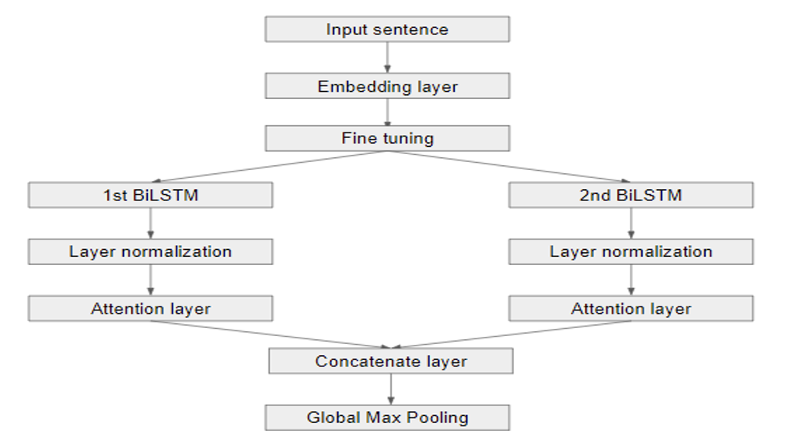

# 📘 BiLSTM Models for Document-level Sentiment Analysis

This repository implements and compares advanced **BiLSTM-based models** for **document-level sentiment analysis** using the Amazon Book Review dataset. The project evaluates traditional BiLSTM variants and contrasts them with **Transformer (BERT)** performance, demonstrating how targeted improvements can close the performance gap.

## 🎯 Project Goals

- Evaluate and improve BiLSTM models for sentiment classification.
- Apply techniques like **fine-tuning**, **self-attention**, **layer normalization**, and **pooling**.
- Compare performance with BERT to assess effectiveness of recurrent models with modern enhancements.

---

## 🧠 Key Contributions

✅ **Enhanced BiLSTM Model**  
- Dual-layer BiLSTM  
- Fine-tuning with pre-trained embeddings  
- Self-attention + Global Max Pooling  
- Layer Normalization for training stability

✅ **Performance Comparison**  
- Evaluated on **recall** and **F1-score**  
- Improved BiLSTM reached **F1 = 0.7112**, surpassing BERT baseline (F1 = 0.6895)

✅ **Real-world Applications**  
Useful for sentiment monitoring in:
- 🛍️ E-commerce review mining  
- 🎯 Product recommendation systems  
- 📈 Business intelligence

---

## 📊 Dataset

Source: [Amazon Book Reviews](https://www.kaggle.com/datasets)  
- **3 classes**: Positive, Negative, Neutral  
- **1000 samples per class**  
- **80/20 train-validation split**  

---

## 🧪 Experimental Results

| Model                                       | Recall  | F1 Score |
|--------------------------------------------|---------|----------|
| BERT Transformer                           | 0.6850  | 0.6895   |
| BiGRU + BiLSTM (hybrid)                    | 0.4783  | 0.4760   |
| 2-layer BiLSTM                             | 0.4900  | 0.4870   |
| + Fine-tuning + BatchNorm                  | 0.6633  | 0.6602   |
| + Fine-tuning + Attention + Pooling        | 0.6683  | 0.6750   |
| + Fine-tuning + LayerNorm + Pooling        | 0.7017  | 0.7063   |
| **All techniques combined (best)**         | **0.7100** | **0.7112** |

---

## 🧬 Model Architecture

The final BiLSTM model includes:
- Pre-trained BERT embeddings  
- Dual BiLSTM branches with normalization  
- Self-attention on each branch  
- Concatenation + Global Max Pooling  
- Fully connected output layer

### Architecture Diagram  


---

## 💻 Usage

### 🔧 Requirements
Install dependencies:
```bash
pip install -r requirements.txt
```

### 🚀 Run

```bash
# Clone repo
git clone https://github.com/your-username/BiLSTM-Sentiment.git
cd BiLSTM-Sentiment

# Train
python train.py --config config.yaml

# Evaluate
python evaluate.py --model_path saved_model.pth
```

---

## 📬 Contact

> 💌 Maintained by **Tao He**  
> ✉️ [hetaoo.c@gmail.com](mailto:hetaoo.c@gmail.com)

---

## 🌈 License
MIT License. See [LICENSE](LICENSE) for details.
